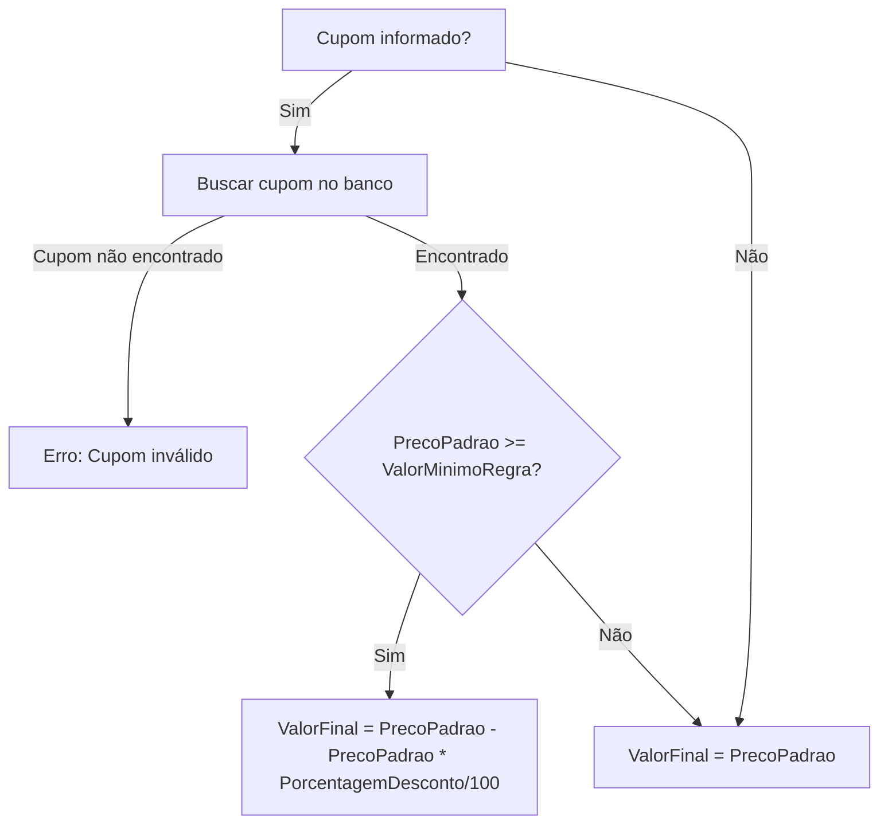

# Detalhamento Técnico — TicketPrime

## FASE 0 — Correções no Banco de Dados

### 0.1 Script SQL — Adicionar colunas em Reservas

**Arquivo**: [`db/script.sql`](db/script.sql)

**Problema**: A tabela `Reservas` atual não possui `CupomUtilizado` nem `ValorFinalPago`, que são exigidos pela especificação oficial.

**SQL a adicionar** (após a criação da tabela `Reservas` existente):

```sql
-- Adiciona coluna CupomUtilizado (FK nullable para Cupons.Codigo)
IF NOT EXISTS (SELECT * FROM sys.columns WHERE object_id = OBJECT_ID(N'[dbo].[Reservas]') AND name = 'CupomUtilizado')
BEGIN
    ALTER TABLE Reservas ADD CupomUtilizado NVARCHAR(20) NULL;
    ALTER TABLE Reservas ADD CONSTRAINT [FK_Reservas_Cupons] 
        FOREIGN KEY ([CupomUtilizado]) REFERENCES [Cupons]([Codigo]);
END
GO

-- Adiciona coluna ValorFinalPago
IF NOT EXISTS (SELECT * FROM sys.columns WHERE object_id = OBJECT_ID(N'[dbo].[Reservas]') AND name = 'ValorFinalPago')
BEGIN
    ALTER TABLE Reservas ADD ValorFinalPago DECIMAL(18,2) NOT NULL DEFAULT 0;
END
GO
```

**Rationale**: A FK `CupomUtilizado` permite nulo porque uma reserva pode ser feita sem cupom. `ValorFinalPago` armazena o preço final já com desconto aplicado (ou o preço padrão se não houver cupom).

---

### 0.2 Model Reserva.cs — Adicionar propriedades

**Arquivo**: [`src/Models/Reserva.cs`](src/Models/Reserva.cs)

**Antes**:
```csharp
public class Reserva
{
    public int Id { get; set; }
    public string UsuarioCpf { get; set; } = string.Empty;
    public int EventoId { get; set; }
    public DateTime DataCompra { get; set; }
}
```

**Depois**:
```csharp
public class Reserva
{
    public int Id { get; set; }
    public string UsuarioCpf { get; set; } = string.Empty;
    public int EventoId { get; set; }
    public DateTime DataCompra { get; set; }
    public string? CupomUtilizado { get; set; }       // NOVO — FK nullable para Cupons
    public decimal ValorFinalPago { get; set; }        // NOVO — preço final com desconto
}
```

**Rationale**: `CupomUtilizado` é nullable (`string?`) porque a coluna no banco permite NULL. `ValorFinalPago` é decimal não-nullable, default 0.

---

### 0.3 ReservaRepository.cs — Incluir novos campos

**Arquivo**: [`src/Infrastructure/Repository/ReservaRepository.cs`](src/Infrastructure/Repository/ReservaRepository.cs)

**INSERT** (método `CriarAsync`):
```csharp
public async Task<Reserva> CriarAsync(Reserva reserva)
{
    using var connection = _connectionFactory.CreateConnection();
    var sql = @"INSERT INTO Reservas (UsuarioCpf, EventoId, DataCompra, CupomUtilizado, ValorFinalPago)
                VALUES (@UsuarioCpf, @EventoId, GETDATE(), @CupomUtilizado, @ValorFinalPago);
                SELECT CAST(SCOPE_IDENTITY() AS INT)";
    var id = await connection.QuerySingleAsync<int>(sql, reserva);
    reserva.Id = id;
    return reserva;
}
```

**SELECT** (método `ListarPorUsuarioAsync`):
```csharp
var sql = @"SELECT r.Id, r.UsuarioCpf, r.EventoId, r.DataCompra,
                   r.CupomUtilizado, r.ValorFinalPago,
                   e.Nome, e.DataEvento, e.PrecoPadrao
            FROM Reservas r
            INNER JOIN Eventos e ON e.Id = r.EventoId
            WHERE r.UsuarioCpf = @Cpf
            ORDER BY r.DataCompra DESC";
```

**NOVO método** para Regra R3 (controle de estoque):
```csharp
public async Task<int> ContarReservasPorEventoAsync(int eventoId)
{
    using var connection = _connectionFactory.CreateConnection();
    var sql = @"SELECT COUNT(*) FROM Reservas WHERE EventoId = @EventoId";
    return await connection.QuerySingleAsync<int>(sql, new { EventoId = eventoId });
}
```

**Rationale**: O parâmetro `@CupomUtilizado` será null quando a compra for sem cupom. O Dapper lida com isso automaticamente.

---

### 0.4 IReservaRepository.cs — Nova interface

**Arquivo**: [`src/Infrastructure/Interface/IReservaRepository.cs`](src/Infrastructure/Interface/IReservaRepository.cs)

```csharp
public interface IReservaRepository
{
    Task<Reserva> CriarAsync(Reserva reserva);
    Task<IEnumerable<ReservaDetalhadaDTO>> ListarPorUsuarioAsync(string cpf);
    Task<bool> CancelarAsync(int reservaId, string usuarioCpf);
    Task<int> ContarReservasUsuarioPorEventoAsync(string usuarioCpf, int eventoId);
    Task<int> ContarReservasPorEventoAsync(int eventoId);  // NOVO
}
```

---

### 0.5 ReservaDetalhadaDTO.cs — Novos campos

**Arquivo**: [`src/DTOs/ReservaDetalhadaDTO.cs`](src/DTOs/ReservaDetalhadaDTO.cs)

```csharp
public class ReservaDetalhadaDTO
{
    public int Id { get; set; }
    public string UsuarioCpf { get; set; } = string.Empty;
    public int EventoId { get; set; }
    public DateTime DataCompra { get; set; }
    public string? CupomUtilizado { get; set; }        // NOVO
    public decimal ValorFinalPago { get; set; }         // NOVO
    public string Nome { get; set; } = string.Empty;       // Nome do evento
    public DateTime DataEvento { get; set; }               // Data do evento
    public decimal PrecoPadrao { get; set; }               // Preço do evento
}
```

---

## FASE 2 — Endpoints AV2 com Regras de Negócio

### 2.1 Rota GET /api/reservas/{cpf}

**Arquivo**: [`src/Program.cs`](src/Program.cs)

**Substituir**:
```csharp
app.MapGet("/api/reservas/minhas", async (...)
```
**Por**:
```csharp
app.MapGet("/api/reservas/{cpf}", async (string cpf, ReservaService service) =>
{
    var reservas = await service.ListarReservasUsuarioAsync(cpf);
    return Results.Ok(reservas);
});
```

**Rationale**: A especificação exige a rota `GET /api/reservas/{cpf}` (com CPF como path parameter) e não `/minhas`.

---

### 2.2 ComprarIngressoDTO — Adicionar CupomUtilizado

**Arquivo**: [`src/DTOs/ComprarIngressoDTO.cs`](src/DTOs/ComprarIngressoDTO.cs)

```csharp
public class ComprarIngressoDTO
{
    public int EventoId { get; set; }
    public string? CupomUtilizado { get; set; }  // NOVO — opcional
}
```

---

### 2.3 a 2.6 — ReservaService com Regras R1-R4

**Arquivo**: [`src/Service/ReservaService.cs`](src/Service/ReservaService.cs)

```csharp
public class ReservaService
{
    private readonly IReservaRepository _reservaRepository;
    private readonly IEventoRepository _eventoRepository;
    private readonly IUsuarioRepository _usuarioRepository;    // NOVO
    private readonly ICupomRepository _cupomRepository;        // NOVO

    public ReservaService(
        IReservaRepository reservaRepository,
        IEventoRepository eventoRepository,
        IUsuarioRepository usuarioRepository,    // NOVO
        ICupomRepository cupomRepository)        // NOVO
    {
        _reservaRepository = reservaRepository;
        _eventoRepository = eventoRepository;
        _usuarioRepository = usuarioRepository;
        _cupomRepository = cupomRepository;
    }

    public async Task<Reserva> ComprarIngressoAsync(
        string usuarioCpf, int eventoId, string? cupomUtilizado = null)
    {
        // R1 — Validação de Integridade
        var usuario = await _usuarioRepository.ObterPorCpf(usuarioCpf);
        if (usuario == null)
            throw new InvalidOperationException("Usuário não encontrado.");

        var evento = await _eventoRepository.ObterPorIdAsync(eventoId);
        if (evento == null)
            throw new InvalidOperationException("Evento não encontrado.");

        if (evento.DataEvento <= DateTime.Now)
            throw new InvalidOperationException("Este evento já aconteceu.");

        // R2 — Limite por CPF (máximo 2 reservas por CPF por evento)
        var reservasCpf = await _reservaRepository
            .ContarReservasUsuarioPorEventoAsync(usuarioCpf, eventoId);
        if (reservasCpf >= 2)
            throw new InvalidOperationException(
                "Você já atingiu o limite de 2 reservas para este evento.");

        // R3 — Controle de Estoque
        var totalReservas = await _reservaRepository
            .ContarReservasPorEventoAsync(eventoId);
        if (totalReservas >= evento.CapacidadeTotal)
            throw new InvalidOperationException(
                "Não há mais vagas disponíveis para este evento.");

        // R4 — Motor de Cupons
        decimal valorFinal = evento.PrecoPadrao;

        if (!string.IsNullOrEmpty(cupomUtilizado))
        {
            var cupom = await _cupomRepository.ObterPorCodigoAsync(cupomUtilizado);
            if (cupom == null)
                throw new InvalidOperationException("Cupom inválido ou inexistente.");

            if (evento.PrecoPadrao >= cupom.ValorMinimoRegra)
            {
                var desconto = evento.PrecoPadrao * (cupom.PorcentagemDesconto / 100);
                valorFinal = evento.PrecoPadrao - desconto;
            }
            // Se não atingiu valor mínimo, mantém preço padrão (sem desconto)
        }

        // Criar reserva
        var reserva = new Reserva
        {
            UsuarioCpf = usuarioCpf,
            EventoId = eventoId,
            CupomUtilizado = cupomUtilizado,
            ValorFinalPago = valorFinal
        };

        return await _reservaRepository.CriarAsync(reserva);
    }
}
```

**Atualizar Program.cs** para injetar os novos repositórios:
```csharp
builder.Services.AddScoped<IUsuarioRepository, UsuarioRepository>();
builder.Services.AddScoped<ICupomRepository, CupomRepository>();  // já deve existir
```

**Atualizar rota POST /api/reservas**:
```csharp
app.MapPost("/api/reservas", async (ComprarIngressoDTO dto, ReservaService service, HttpContext context) =>
{
    try
    {
        var cpf = context.User.FindFirst(
            System.Security.Claims.ClaimTypes.NameIdentifier)?.Value;

        if (string.IsNullOrEmpty(cpf))
            return Results.Unauthorized();

        var reserva = await service.ComprarIngressoAsync(
            cpf, dto.EventoId, dto.CupomUtilizado);
        
        return Results.Created($"/api/reservas/{reserva.Id}", new
        {
            mensagem = "Ingresso comprado com sucesso!",
            reservaId = reserva.Id,
            eventoId = reserva.EventoId,
            valorFinalPago = reserva.ValorFinalPago,
            cupomUtilizado = reserva.CupomUtilizado
        });
    }
    catch (InvalidOperationException ex)
    {
        return Results.BadRequest(new { mensagem = ex.Message });
    }
}).RequireAuthorization();
```

**Diagrama de Decisão R4 (Cupom)**:


---

## FASE 4 — Documentação AV2

### 4.1 ADR — docs/adr.md

**Arquivo**: [`docs/adr.md`](docs/adr.md)

Estrutura exigida:
```markdown
# ADR-001: Uso de Dapper com SQL Puro

## Contexto
O sistema TicketPrime necessita de um mecanismo de acesso a dados que seja 
seguro contra SQL Injection e permita controle total sobre as queries. 
A equipe considerou Entity Framework (Code-First) e Dapper.

## Decisão
Utilizar Dapper com parâmetros nomeados (prefixo @) para todas as operações 
de banco de dados, combinado com um DbConnectionFactory para gerenciar 
conexões SQL Server.

## Consequências

### Prós:
- Segurança contra SQL Injection (parâmetros @ obrigatórios)
- Performance superior ao Entity Framework
- Controle total sobre o SQL gerado
- Leve e sem overhead de ORM
- Ideal para cenários com regras de negócio complexas

### Contras:
- Mais código manual (CREATE TABLE, INSERT, SELECT)
- Sem migrations automáticas
- Sem validação de modelo em tempo de compilação
- Necessidade de manutenção manual do script SQL
```

**Arquivo**: [`docs/adr.md`](docs/adr.md) completo — incluir ADR-002 sobre Minimal API e ADR-003 sobre Blazor Server.

---

### 4.2 a 4.5 — docs/operacao.md

**Arquivo**: [`docs/operacao.md`](docs/operacao.md)

```markdown
# Operação — TicketPrime

## Matriz de Riscos

| Risco | Probabilidade | Impacto | Ação | Gatilho |
|-------|--------------|---------|------|---------|
| Superlotação de evento | Média | Alto | Implementar R3 com COUNT atômico e transação isolada antes do INSERT | Venda atinge 90% da capacidade |
| Fraude com cupom | Baixa | Alto | R4 valida ValorMinimoRegra antes de aplicar desconto | Cupom público divulgado em massa |
| SQL Injection | Muito Baixa | Crítico | Revisão de código obrigatória — proibido concatenação ou $ em SQL | Nova query adicionada ao repositório |
| Vazamento de connection string | Média | Crítico | Usar User Secrets em dev e variáveis de ambiente em prod | Commit com Password= no repositório |
| Indisponibilidade do SQL Server | Baixa | Alto | Retry policy no DbConnectionFactory e health check | Falha de conexão no pool |

## Métricas Operacionais

### Métrica 1: Taxa de Sucesso de Reservas
- **Fórmula:** (Reservas com sucesso / Total de tentativas de compra) * 100
- **Fonte de Dados:** Logs da aplicação (Application Insights / arquivo de log)
- **Frequência:** Diária
- **Ação se Violado:** Se < 95%, investigar causa raiz e corrigir em até 24h

### Métrica 2: Tempo de Resposta (p95)
- **Fórmula:** Percentil 95 do tempo de resposta do endpoint POST /api/reservas
- **Fonte de Dados:** APM / Middleware de logging
- **Frequência:** A cada requisição
- **Ação se Violado:** Se > 2s, revisar índices do banco e otimizar queries

## SLO (Service Level Objective)

**SLO: 99.5%** de disponibilidade mensal (janela de 30 dias corridos).

O sistema pode ficar indisponível por no máximo 3 horas e 36 minutos por mês.

## Error Budget Policy

**Error Budget:** 0.5% do tempo mensal (≈ 3h36min).

- **Enquanto o budget não for exaurido:** O time pode continuar entregando novas funcionalidades normalmente.
- **Se o budget for exaurido:** O time DEVE:
  1. Parar todo desenvolvimento de novas features
  2. Dedicar 100% do tempo para corrigir a causa raiz
  3. Implementar melhorias de resiliência
  4. Só retomar desenvolvimento após 7 dias consecutivos sem violação
  5. Documentar o incidente em Postmortem
```

---

### 4.6 release_checklist_final.md

**Arquivo**: [`release_checklist_final.md`](release_checklist_final.md) (na raiz do projeto)

```markdown
# Release Checklist Final — TicketPrime

## Código
- [x] Todas as rotas AV1 mapeadas (POST/GET /api/eventos, POST /api/cupons, POST /api/usuarios)
- [x] Todas as rotas AV2 mapeadas (GET /api/reservas/{cpf}, POST /api/reservas)
- [x] Regras de negócio R1-R4 implementadas em ReservaService
- [x] Dapper com parâmetros @ em todas as queries
- [x] Sem concatenação ou interpolação em SQL (zero SQL Injection)
- [x] Nenhuma senha hardcoded nos arquivos .cs (SSDF)

## Banco de Dados
- [x] Script SQL com CREATE TABLE para Usuarios, Eventos, Cupons, Reservas
- [x] Foreign Keys configuradas: Reservas.UsuarioCpf → Usuarios.Cpf, Reservas.EventoId → Eventos.Id, Reservas.CupomUtilizado → Cupons.Codigo
- [x] Colunas CupomUtilizado (nullable) e ValorFinalPago presentes em Reservas

## Documentação
- [x] Histórias de Usuário em docs/requisitos.md (mínimo 3)
- [x] Critérios BDD no formato Dado/Quando/Então
- [x] ADR em docs/adr.md com Contexto, Decisão, Consequências (Prós/Contras)
- [x] Matriz de Riscos em docs/operacao.md com Risco, Probabilidade, Impacto, Ação, Gatilho
- [x] Métricas Operacionais com Fórmula, Fonte de Dados, Frequência, Ação se Violado
- [x] SLO definido com porcentagem e janela de tempo
- [x] Error Budget Policy documentada

## Testes
- [x] Projeto xUnit configurado na pasta /tests
- [x] Todos os testes possuem cláusula Assert
- [x] Testes para validação R1 (integridade)
- [x] Testes para validação R2 (limite CPF)
- [x] Testes para validação R3 (controle de estoque)
- [x] Testes para validação R4 (motor de cupons)
- [x] Testes para GET /api/reservas/{cpf} com INNER JOIN

## Infraestrutura
- [x] README.md com comandos dotnet run
- [x] docker-compose.yml configurado
```

---

### 4.7 Segurança SSDF — Remover hardcoded

**Arquivo**: [`src/Program.cs`](src/Program.cs)

**Problema atual** (linha 20):
```csharp
var connectionString = builder.Configuration.GetConnectionString("DefaultConnection")
    ?? "Server=localhost;Database=TicketPrime;Integrated Security=True;...";
```

**Solução**: Mover para [`src/appsettings.json`](src/appsettings.json):
```json
{
  "ConnectionStrings": {
    "DefaultConnection": "Server=localhost;Database=TicketPrime;Integrated Security=True;TrustServerCertificate=True;"
  },
  "Jwt": {
    "Key": "TicketPrimeChaveSecreta2024SuperSegura!"
  }
}
```

E em [`src/Program.cs`](src/Program.cs):
```csharp
var connectionString = builder.Configuration.GetConnectionString("DefaultConnection")
    ?? throw new InvalidOperationException("Connection string not configured.");
```

**docker-compose.yml**: A senha do SA está hardcoded. Manter como está (é só para dev local), mas documentar que em produção deve vir de variável de ambiente `${SA_PASSWORD}`.

---

## FASE 5 — Frontend Blazor

### 5.1 Formulário de compra com cupom

**Arquivo**: Página de compra de ingresso (ex: `ComprarIngresso.razor`)

O formulário atual deve ganhar um campo opcional:
```razor
<div class="form-group">
    <label for="cupom">Cupom de Desconto (opcional):</label>
    <input type="text" class="form-control" id="cupom" 
           @bind="CupomUtilizado" placeholder="Ex: PROMO10" />
</div>
```

E o DTO enviado deve incluir:
```csharp
var dto = new { EventoId = eventoId, CupomUtilizado = CupomUtilizado };
```

### 5.2 Listagem de reservas

A tabela de reservas deve exibir as novas colunas:
```razor
<th>Cupom</th>
<th>Valor Pago</th>
...
<td>@reserva.CupomUtilizado ?? "—"</td>
<td>@reserva.ValorFinalPago.ToString("C")</td>
```

---

## FASE 6 — Testes Unitários

### 6.1 Teste R1 — Integridade

```csharp
[Fact]
public async Task ComprarIngresso_DeveLancarExcecao_QuandoUsuarioNaoExiste()
{
    var usuarioRepoMock = new Mock<IUsuarioRepository>();
    usuarioRepoMock.Setup(r => r.ObterPorCpf(It.IsAny<string>()))
                   .ReturnsAsync((Usuario?)null);
    
    var service = new ReservaService(
        _reservaRepoMock.Object,
        _eventoRepoMock.Object,
        usuarioRepoMock.Object,
        _cupomRepoMock.Object);

    var ex = await Assert.ThrowsAsync<InvalidOperationException>(
        () => service.ComprarIngressoAsync("00000000000", 1, null));
    
    Assert.Equal("Usuário não encontrado.", ex.Message);
    _reservaRepoMock.Verify(r => r.CriarAsync(It.IsAny<Reserva>()), Times.Never);
}
```

### 6.2 Teste R2 — Limite CPF

```csharp
[Fact]
public async Task ComprarIngresso_DeveLancarExcecao_QuandoLimiteCpfAtingido()
{
    // Setup: usuário existe, evento existe, mas já tem 2 reservas
    _usuarioRepoMock.Setup(r => r.ObterPorCpf("123")).ReturnsAsync(new Usuario());
    _eventoRepoMock.Setup(r => r.ObterPorIdAsync(1)).ReturnsAsync(new Evento("Teste", 100, DateTime.Now.AddDays(10), 100m));
    _reservaRepoMock.Setup(r => r.ContarReservasUsuarioPorEventoAsync("123", 1)).ReturnsAsync(2);

    var service = new ReservaService(/* ... */);

    var ex = await Assert.ThrowsAsync<InvalidOperationException>(
        () => service.ComprarIngressoAsync("123", 1, null));
    
    Assert.Equal("Você já atingiu o limite de 2 reservas para este evento.", ex.Message);
}
```

### 6.3 Teste R3 — Estoque

```csharp
[Fact]
public async Task ComprarIngresso_DeveLancarExcecao_QuandoEventoLotado()
{
    // Setup: capacidade = 10, já existem 10 reservas
    _usuarioRepoMock.Setup(r => r.ObterPorCpf("123")).ReturnsAsync(new Usuario());
    _eventoRepoMock.Setup(r => r.ObterPorIdAsync(1))
        .ReturnsAsync(new Evento("Teste", 10, DateTime.Now.AddDays(10), 100m));
    _reservaRepoMock.Setup(r => r.ContarReservasPorEventoAsync(1)).ReturnsAsync(10);

    var service = new ReservaService(/* ... */);

    var ex = await Assert.ThrowsAsync<InvalidOperationException>(
        () => service.ComprarIngressoAsync("123", 1, null));

    Assert.Equal("Não há mais vagas disponíveis para este evento.", ex.Message);
}
```

### 6.4 Teste R4 — Cupom

```csharp
[Fact]
public async Task ComprarIngresso_DeveAplicarDesconto_QuandoPrecoSuficiente()
{
    // Setup: evento com preço 200, cupom COM 20% de desconto, valor mínimo 100
    _usuarioRepoMock.Setup(r => r.ObterPorCpf("123")).ReturnsAsync(new Usuario());
    _eventoRepoMock.Setup(r => r.ObterPorIdAsync(1))
        .ReturnsAsync(new Evento("Teste", 100, DateTime.Now.AddDays(10), 200m));
    _cupomRepoMock.Setup(r => r.ObterPorCodigoAsync("PROMO20"))
        .ReturnsAsync(new Cupom { Codigo = "PROMO20", PorcentagemDesconto = 20, ValorMinimoRegra = 100 });
    _reservaRepoMock.Setup(r => r.ContarReservasPorEventoAsync(1)).ReturnsAsync(0);
    _reservaRepoMock.Setup(r => r.ContarReservasUsuarioPorEventoAsync("123", 1)).ReturnsAsync(0);
    _reservaRepoMock.Setup(r => r.CriarAsync(It.IsAny<Reserva>()))
        .ReturnsAsync((Reserva r) => r);

    var service = new ReservaService(/* ... */);

    var result = await service.ComprarIngressoAsync("123", 1, "PROMO20");

    Assert.Equal(160m, result.ValorFinalPago); // 200 - 20% = 160
    Assert.Equal("PROMO20", result.CupomUtilizado);
}

[Fact]
public async Task ComprarIngresso_NaoDeveAplicarDesconto_QuandoPrecoMenorQueMinimo()
{
    // Setup: evento com preço 50, cupom COM 20% de desconto, valor mínimo 100
    // Como 50 < 100, NÃO aplica desconto
    _usuarioRepoMock.Setup(r => r.ObterPorCpf("123")).ReturnsAsync(new Usuario());
    _eventoRepoMock.Setup(r => r.ObterPorIdAsync(1))
        .ReturnsAsync(new Evento("Teste", 100, DateTime.Now.AddDays(10), 50m));
    _cupomRepoMock.Setup(r => r.ObterPorCodigoAsync("PROMO20"))
        .ReturnsAsync(new Cupom { Codigo = "PROMO20", PorcentagemDesconto = 20, ValorMinimoRegra = 100 });
    _reservaRepoMock.Setup(r => r.ContarReservasPorEventoAsync(1)).ReturnsAsync(0);
    _reservaRepoMock.Setup(r => r.ContarReservasUsuarioPorEventoAsync("123", 1)).ReturnsAsync(0);
    _reservaRepoMock.Setup(r => r.CriarAsync(It.IsAny<Reserva>()))
        .ReturnsAsync((Reserva r) => r);

    var service = new ReservaService(/* ... */);

    var result = await service.ComprarIngressoAsync("123", 1, "PROMO20");

    Assert.Equal(50m, result.ValorFinalPago); // Sem desconto
}
```

---

## Resumo de Arquivos a Criar/Modificar

| Arquivo | Ação | Fase |
|---------|------|------|
| `db/script.sql` | Modificar — adicionar colunas | 0.1 |
| `src/Models/Reserva.cs` | Modificar — adicionar propriedades | 0.2 |
| `src/Infrastructure/Repository/ReservaRepository.cs` | Modificar — INSERT/SELECT + novo método | 0.3 |
| `src/Infrastructure/Interface/IReservaRepository.cs` | Modificar — nova interface | 0.4 |
| `src/DTOs/ReservaDetalhadaDTO.cs` | Modificar — novos campos | 0.5 |
| `src/DTOs/ComprarIngressoDTO.cs` | Modificar — campo CupomUtilizado | 2.2 |
| `src/Service/ReservaService.cs` | Modificar — R1-R4 + injeção de dependências | 2.3-2.6 |
| `src/Program.cs` | Modificar — rotas + injeção | 2.1, 2.6 |
| `src/appsettings.json` | Modificar — connection string segura | 4.7 |
| `docs/adr.md` | **Criar** — ADR | 4.1 |
| `docs/operacao.md` | **Criar** — riscos, métricas, SLO, error budget | 4.2-4.5 |
| `release_checklist_final.md` | **Criar** — DoD checklist | 4.6 |
| `ui/TicketPrime.Web/Pages/*.razor` | Modificar — formulário e listagem | 5.1-5.2 |
| `tests/*.cs` | **Criar** — novos testes unitários | 6.1-6.5 |
