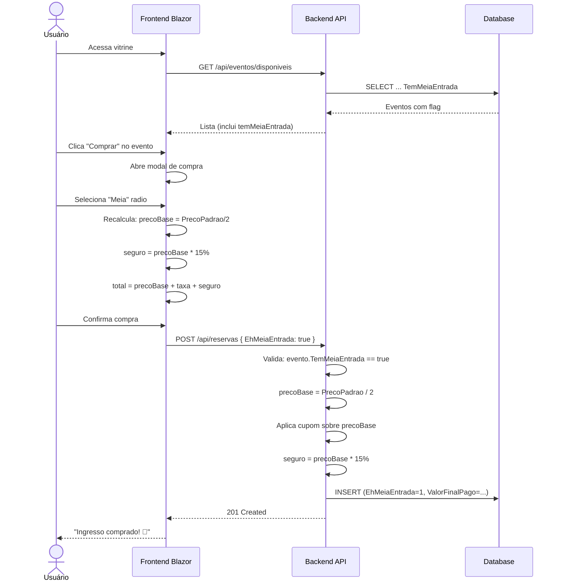

# 📋 Plano de Implementação: Meia-Entrada (Lei 12.933/2013)

> **✅ STATUS DE IMPLEMENTAÇÃO (2026-05-10):** Este plano foi **totalmente implementado**. Todas as camadas (banco, modelos, DTOs, repositories, services, controllers e frontend) foram alteradas conforme especificado abaixo. A meia-entrada está operacional: eventos com `TemMeiaEntrada = true` exibem a opção de meia-entrada no modal de compra, e o backend calcula corretamente o preço base (50% do `PrecoPadrao`), aplica cupom sobre o preço base e calcula o seguro sobre o preço base. Consulte os arquivos de código para o estado atual.

## Visão Geral

Adicionar suporte a meia-entrada conforme exigido pela **Lei 12.933/2013**, que obriga eventos culturais, esportivos e de lazer a oferecerem ingressos com 50% de desconto para estudantes, idosos (60+), pessoas com deficiência e jovens de baixa renda. **✅ Implementado.**

**Premissas de negócio:**
- Meia-entrada = exatamente **50% do `PrecoPadrao`** do evento (fixo por lei)
- O organizador decide se o evento **oferece** meia-entrada via flag `TemMeiaEntrada`
- O comprador **seleciona o tipo** (Inteira/Meia) no modal de compra e **declara** ser beneficiário
- Validação documental é feita **presencialmente na portaria** — o sistema não valida documentos
- Cupom de desconto e seguro (15%) são calculados **sobre o `precoBase` escolhido**
- Eventos gratuitos não precisam de meia-entrada
- O backend serializa `precoMeiaEntrada` calculado para o frontend consumir

---

## ⚠️ Dívida Técnica Conhecida: Validação da Cota de 40%

A **Lei 12.933/2013** determina que **no mínimo 40%** dos ingressos de cada evento sejam destinados à meia-entrada. Esta versão **não implementa** essa validação por duas razões:

1. A regulamentação varia por município/estado (alguns exigem 40%, outros 50%)
2. A lógica de cota dinâmica (bloquear venda de inteira se cair abaixo de 60:40) requer contadores atômicos no banco e validação transacional

**Para uma versão futura**, recomenda-se:
- Adicionar coluna `IngressosMeiaVendidos` e `IngressosInteiraVendidos` em `Eventos` (ou computar via `COUNT` em `Reservas`)
- No `ReservaService.ComprarIngressoAsync`, validar: se tentar comprar inteira e a proporção de meias vendidas for < 40% da capacidade, bloquear e sugerir meia-entrada
- Exibir na UI: "Restam X ingressos de meia-entrada" com contagem regressiva

---

## Arquitetura das Alterações

```mermaid
flowchart TB
    subgraph Frontend
        EC[EventoCreate.razor<br/>+ checkbox Meia-Entrada]
        ED[EventosDisponiveis.razor<br/>+ radio button tipo ingresso]
        DD[DetalheEvento.razor<br/>+ exibe preços]
        MP[MeuPerfil.razor<br/>+ badge tipo]
    end

    subgraph Backend
        RC[ReservaController]
        RS[ReservaService]
        ER[EventoRepository]
        RR[ReservaRepository]
        ECtrl[EventoController]
    end

    subgraph Database
        DB[(SQL Server)]
    end

    EC -->|POST /api/eventos<br/>+ TemMeiaEntrada| ECtrl
    ECtrl --> ER --> DB
    ED -->|POST /api/reservas<br/>+ EhMeiaEntrada| RC
    RC --> RS --> RR --> DB
    DD -->|GET /api/eventos/{id}<br/>+ TemMeiaEntrada + precoMeiaEntrada| ECtrl
    MP -->|GET /api/reservas/{cpf}<br/>+ EhMeiaEntrada| RC
```

---

## Etapas de Implementação

### Passo 1: Migração do Banco de Dados

**Arquivo:** [`db/script.sql`](db/script.sql) — adicionar ao final (antes dos índices FTS)

```sql
-- ─── Meia-Entrada Lei 12.933/2013 ──────────────────────────────────

-- Eventos: flag que indica se o evento oferece meia-entrada
IF NOT EXISTS (SELECT * FROM sys.columns WHERE object_id = OBJECT_ID(N'[dbo].[Eventos]') AND name = 'TemMeiaEntrada')
BEGIN
    ALTER TABLE Eventos ADD TemMeiaEntrada BIT NOT NULL DEFAULT 0;
END
GO

-- Reservas: flag que indica se o ingresso foi comprado como meia-entrada
IF NOT EXISTS (SELECT * FROM sys.columns WHERE object_id = OBJECT_ID(N'[dbo].[Reservas]') AND name = 'EhMeiaEntrada')
BEGIN
    ALTER TABLE Reservas ADD EhMeiaEntrada BIT NOT NULL DEFAULT 0;
END
GO
```

**Efeito:** Coluna `TemMeiaEntrada` em `Eventos` (default `0` = compatibilidade retroativa). Coluna `EhMeiaEntrada` em `Reservas` para auditoria e relatórios.

---

### Passo 2: Modelos Backend

#### [`src/Models/TicketEvent.cs`](src/Models/TicketEvent.cs:1)
Adicionar:
```csharp
public bool TemMeiaEntrada { get; set; }
```

#### [`src/Models/Reservation.cs`](src/Models/Reservation.cs:1)
Adicionar:
```csharp
public bool EhMeiaEntrada { get; set; }
```

---

### Passo 3a: [`src/DTOs/CreateEventDto.cs`](src/DTOs/CreateEventDto.cs:1)

Adicionar ao `record`:
```csharp
public bool TemMeiaEntrada { get; set; }
```

---

### Passo 3b: [`src/DTOs/EventDetailDto.cs`](src/DTOs/EventDetailDto.cs:1)

Adicionar:
```csharp
[JsonPropertyName("temMeiaEntrada")]
public bool TemMeiaEntrada { get; set; }

[JsonPropertyName("precoMeiaEntrada")]
public decimal PrecoMeiaEntrada => PrecoPadrao / 2;
```

**Decisão:** `PrecoMeiaEntrada` é **serializado** (sem `[JsonIgnore]`). O backend envia o valor calculado para o frontend, mantendo a lógica de 50% em um único lugar.

---

### Passo 3c: [`src/DTOs/PurchaseTicketDto.cs`](src/DTOs/PurchaseTicketDto.cs:1)

Adicionar:
```csharp
public bool EhMeiaEntrada { get; set; }
```

---

### Passo 3d: [`src/DTOs/ReservationDetailDto.cs`](src/DTOs/ReservationDetailDto.cs:1)

**Atenção:** O `ReservationDetailDto` do backend **não usa `[JsonPropertyName]`** (ao contrário dos DTOs com namespace `System.Text.Json.Serialization`). Manter o estilo existente — sem atributos:
```csharp
/// <summary>Indica se o ingresso foi comprado como meia-entrada (Lei 12.933/2013).</summary>
public bool EhMeiaEntrada { get; set; }
```

O ASP.NET Core serializa `EhMeiaEntrada` como `"ehMeiaEntrada"` por padrão (camelCase), que é o nome esperado pelo frontend.

---

### Passo 4a: [`src/Infrastructure/Repository/EventoRepository.cs`](src/Infrastructure/Repository/EventoRepository.cs:21)

**INSERT (`AdicionarAsync`)** — SQL atual (linhas 24-30):
```sql
INSERT INTO Eventos (
    Nome, CapacidadeTotal, DataEvento, PrecoPadrao, LimiteIngressosPorUsuario,
    Local, Descricao, GeneroMusical, EventoGratuito, Status, TaxaServico)
OUTPUT INSERTED.Id
VALUES (
    @Nome, @CapacidadeTotal, @DataEvento, @PrecoPadrao, @LimiteIngressosPorUsuario,
    @Local, @Descricao, @GeneroMusical, @EventoGratuito, @Status, @TaxaServico)
```

**SQL corrigido — adicionar `TemMeiaEntrada` e `@TemMeiaEntrada`:**
```sql
INSERT INTO Eventos (
    Nome, CapacidadeTotal, DataEvento, PrecoPadrao, LimiteIngressosPorUsuario,
    Local, Descricao, GeneroMusical, EventoGratuito, Status, TaxaServico,
    TemMeiaEntrada)
OUTPUT INSERTED.Id
VALUES (
    @Nome, @CapacidadeTotal, @DataEvento, @PrecoPadrao, @LimiteIngressosPorUsuario,
    @Local, @Descricao, @GeneroMusical, @EventoGratuito, @Status, @TaxaServico,
    @TemMeiaEntrada)
```

**SELECTs** (`ObterPorIdAsync`, `ObterTodosAsync`, `BuscarDisponiveisAsync`): Usam `SELECT *`, portanto a nova coluna será capturada automaticamente pelo Dapper, desde que `TicketEvent` tenha a propriedade `TemMeiaEntrada`.

---

### Passo 4b: [`src/Infrastructure/Repository/ReservaRepository.cs`](src/Infrastructure/Repository/ReservaRepository.cs:17)

**INSERT (`CriarAsync`)** — SQL atual (linhas 20-23):
```sql
INSERT INTO Reservas (UsuarioCpf, EventoId, DataCompra, CupomUtilizado, ValorFinalPago,
                      TaxaServicoPago, TemSeguro, ValorSeguroPago, CodigoIngresso, Status)
VALUES (@UsuarioCpf, @EventoId, GETDATE(), @CupomUtilizado, @ValorFinalPago,
        @TaxaServicoPago, @TemSeguro, @ValorSeguroPago, @CodigoIngresso, 'Ativa');
```

**SQL corrigido — adicionar `EhMeiaEntrada` e `@EhMeiaEntrada`:**
```sql
INSERT INTO Reservas (UsuarioCpf, EventoId, DataCompra, CupomUtilizado, ValorFinalPago,
                      TaxaServicoPago, TemSeguro, ValorSeguroPago, CodigoIngresso, Status,
                      EhMeiaEntrada)
VALUES (@UsuarioCpf, @EventoId, GETDATE(), @CupomUtilizado, @ValorFinalPago,
        @TaxaServicoPago, @TemSeguro, @ValorSeguroPago, @CodigoIngresso, 'Ativa',
        @EhMeiaEntrada);
```

**SELECTs — adicionar `r.EhMeiaEntrada` em TODOS:**

1. `ListarPorUsuarioAsync` (linha 33-41):
```sql
SELECT r.Id, r.UsuarioCpf, r.EventoId, r.DataCompra,
       r.CupomUtilizado, r.ValorFinalPago,
       r.TaxaServicoPago, r.TemSeguro, r.ValorSeguroPago,
       r.CodigoIngresso, r.Status, r.EhMeiaEntrada,
       e.Nome, e.DataEvento, e.PrecoPadrao
FROM Reservas r
INNER JOIN Eventos e ON e.Id = r.EventoId
WHERE r.UsuarioCpf = @Cpf
ORDER BY r.DataCompra DESC
```

2. `ObterDetalhadaPorIdAsync` (linha 84-91):
```sql
SELECT r.Id, r.UsuarioCpf, r.EventoId, r.DataCompra,
       r.CupomUtilizado, r.ValorFinalPago,
       r.TaxaServicoPago, r.TemSeguro, r.ValorSeguroPago,
       r.CodigoIngresso, r.Status, r.EhMeiaEntrada,
       e.Nome, e.DataEvento, e.PrecoPadrao
FROM Reservas r
INNER JOIN Eventos e ON e.Id = r.EventoId
WHERE r.Id = @ReservaId AND r.UsuarioCpf = @UsuarioCpf
```

3. `ObterPorCodigoIngressoAsync` (linha 99-106):
```sql
SELECT r.Id, r.UsuarioCpf, r.EventoId, r.DataCompra,
       r.CupomUtilizado, r.ValorFinalPago,
       r.TaxaServicoPago, r.TemSeguro, r.ValorSeguroPago,
       r.CodigoIngresso, r.Status, r.DataCheckin, r.EhMeiaEntrada,
       e.Nome, e.DataEvento, e.PrecoPadrao
FROM Reservas r
INNER JOIN Eventos e ON e.Id = r.EventoId
WHERE r.CodigoIngresso = @CodigoIngresso
```

---

### Passo 5: [`src/Service/ReservaService.cs`](src/Service/ReservaService.cs:47)

**Método `ComprarIngressoAsync`** — Assinatura atual (linha 47-53):
```csharp
public async Task<Reservation> ComprarIngressoAsync(
    string usuarioCpf,
    int eventoId,
    string? cupomUtilizado = null,
    bool contratarSeguro = false,
    string? ipAddress = null,
    string? userAgent = null)
```

**Nova assinatura:**
```csharp
public async Task<Reservation> ComprarIngressoAsync(
    string usuarioCpf,
    int eventoId,
    string? cupomUtilizado = null,
    bool contratarSeguro = false,
    bool ehMeiaEntrada = false,
    string? ipAddress = null,
    string? userAgent = null)
```

**Lógica de cálculo — substituir no corpo do método:**

**Linha 73 (atual):**
```csharp
decimal valorIngresso = evento.PrecoPadrao;
```

**Substituir por:**
```csharp
// Determina o preço base conforme o tipo de ingresso
if (ehMeiaEntrada && !evento.TemMeiaEntrada)
    throw new InvalidOperationException("Este evento não oferece meia-entrada.");

decimal precoBase = ehMeiaEntrada ? evento.PrecoPadrao / 2 : evento.PrecoPadrao;
decimal valorIngresso = precoBase;
```

**Validação de cupom — linhas 108-118 (cálculo de desconto):**

Substituir `evento.PrecoPadrao` por `precoBase` em todos os cálculos:
```csharp
if (evento.PrecoPadrao >= cupom.ValorMinimoRegra)  // mantém PrecoPadrao aqui (regra do cupom)
{
    decimal desconto;
    if (cupom.TipoDesconto == Models.DiscountType.ValorFixo && cupom.ValorDescontoFixo.HasValue)
    {
        desconto = cupom.ValorDescontoFixo.Value;
    }
    else
    {
        desconto = precoBase * (cupom.PorcentagemDesconto / 100);  ← mudou
    }
    valorIngresso = Math.Max(0, precoBase - desconto);             ← mudou
    aplicarDesconto = true;
}
```

**Seguro — linha 127 (atual):**
```csharp
decimal valorSeguro = contratarSeguro ? evento.PrecoPadrao * 0.15m : 0m;
```
**Substituir por:**
```csharp
decimal valorSeguro = contratarSeguro ? precoBase * 0.15m : 0m;
```

**Reserva — adicionar ao objeto (linhas 129-138):**
```csharp
var reserva = new Reservation
{
    UsuarioCpf       = usuarioCpf,
    EventoId         = eventoId,
    CupomUtilizado   = cupomUtilizado,
    TaxaServicoPago  = taxaServico,
    TemSeguro        = contratarSeguro,
    ValorSeguroPago  = valorSeguro,
    EhMeiaEntrada    = ehMeiaEntrada,              ← NOVO
    ValorFinalPago   = valorIngresso + taxaServico + valorSeguro
};
```

**Valor do desconto na auditoria — linha 168 (atual):**
```csharp
valorDesconto = evento.PrecoPadrao - valorIngresso;
```
**Substituir por:**
```csharp
valorDesconto = precoBase - valorIngresso;
```

---

### Passo 6: [`src/Controllers/ReservaController.cs`](src/Controllers/ReservaController.cs:25)

**Método `POST`** — Chamada atual para `ComprarIngressoAsync`:
```csharp
var reserva = await _reservaService.ComprarIngressoAsync(
    cpf, dto.EventoId, dto.CupomUtilizado, dto.ContratarSeguro,
    ipAddress: ipAddress, userAgent: userAgent);
```

**Substituir por:**
```csharp
var reserva = await _reservaService.ComprarIngressoAsync(
    cpf, dto.EventoId, dto.CupomUtilizado, dto.ContratarSeguro, dto.EhMeiaEntrada,
    ipAddress: ipAddress, userAgent: userAgent);
```

---

### Passo 7a: [`ui/TicketPrime.Web/Models/EventoCreateModels.cs`](ui/TicketPrime.Web/Models/EventoCreateModels.cs:24)

Adicionar ao `EventoCreateDto`:
```csharp
public bool TemMeiaEntrada { get; set; }
```

---

### Passo 7b: [`ui/TicketPrime.Web/Models/CriarEventoDto.cs`](ui/TicketPrime.Web/Models/CriarEventoDto.cs:7)

Adicionar ao `CreateEventDto`:
```csharp
public bool TemMeiaEntrada { get; set; }
```

No mapeamento em [`EventoCreate.razor.cs`](ui/TicketPrime.Web/Components/Pages/EventoCreate.razor.cs), adicionar **dentro do bloco `new CreateEventDto { ... }`**, logo após `Status = _evento.Status,` (linha ~426):
```csharp
TemMeiaEntrada = _evento.TemMeiaEntrada,
```

---

### Passo 7c: [`ui/TicketPrime.Web/Components/Pages/EventoCreate.razor`](ui/TicketPrime.Web/Components/Pages/EventoCreate.razor:426)

Dentro do Card "Ingressos", após o checkbox "Evento gratuito" (linha 447), adicionar:
```razor
@if (!_evento.EventoGratuito)
{
    <label class="ec-checkbox-row" style="margin-top:0.5rem;">
        <input type="checkbox" @bind="_evento.TemMeiaEntrada" />
        <span class="ec-checkbox-label">Oferecer meia-entrada Lei 12.933/2013</span>
    </label>
    @if (_evento.TemMeiaEntrada && _evento.Preco.HasValue)
    {
        <span class="ec-hint">
            Ingresso com meia-entrada será vendido por
            <strong>R$ @((_evento.Preco.Value / 2).ToString("F2"))</strong>
            (50% do valor padrão).
        </span>
    }
}
```

---

### Passo 7d: [`ui/TicketPrime.Web/Validators/EventoDtoValidator.cs`](ui/TicketPrime.Web/Validators/EventoDtoValidator.cs:10)

Adicionar regra:
```csharp
RuleFor(x => x.Preco)
    .NotNull()
        .WithMessage("É necessário definir um preço para oferecer meia-entrada.")
    .When(x => x.TemMeiaEntrada);
```

---

### Passo 8a: [`ui/TicketPrime.Web/Models/DtoModels.cs`](ui/TicketPrime.Web/Models/DtoModels.cs:8) — TicketEvent (vitrine)

**⚠️ Passo ausente na versão anterior — crítico para o modal de compra funcionar.**

`EventosDisponiveis.razor` usa `TicketEvent` (não `EventDetailDto`) tanto para a listagem quanto para o modal de compra:
```csharp
private List<TicketEvent>? eventosDisponiveis;
private TicketEvent? eventoSelecionado;
```

Portanto, `TemMeiaEntrada` **também deve ser adicionado à classe `TicketEvent` do frontend** (linha ~8), logo após `TaxaServico`:
```csharp
[JsonPropertyName("temMeiaEntrada")]
public bool TemMeiaEntrada { get; set; }
```

> Sem este passo, `eventoSelecionado.TemMeiaEntrada` será sempre `false` e o radio button de meia-entrada nunca aparecerá no modal, mesmo que o evento tenha a flag habilitada.

---

### Passo 8b: [`ui/TicketPrime.Web/Models/DtoModels.cs`](ui/TicketPrime.Web/Models/DtoModels.cs:382) — EventDetailDto (página de detalhe)

Adicionar (usado por `DetalheEvento.razor`):
```csharp
[JsonPropertyName("temMeiaEntrada")]
public bool TemMeiaEntrada { get; set; }

[JsonPropertyName("precoMeiaEntrada")]
public decimal PrecoMeiaEntrada { get; set; }
```

---

### Passo 8c: [`ui/TicketPrime.Web/Models/DtoModels.cs`](ui/TicketPrime.Web/Models/DtoModels.cs:180) — PurchaseTicketDto

Adicionar:
```csharp
[JsonPropertyName("ehMeiaEntrada")]
public bool EhMeiaEntrada { get; set; }
```

---

### Passo 8d: [`ui/TicketPrime.Web/Models/DtoModels.cs`](ui/TicketPrime.Web/Models/DtoModels.cs:58) — ReservationDetailDto

Adicionar:
```csharp
[JsonPropertyName("ehMeiaEntrada")]
public bool EhMeiaEntrada { get; set; }
```

---

### Passo 9: [`ui/TicketPrime.Web/Components/Pages/DetalheEvento.razor`](ui/TicketPrime.Web/Components/Pages/DetalheEvento.razor:726)

Substituir a seção de preço (atuais linhas 733-743):
```razor
@if (evento.EventoGratuito)
{
    <div class="de-buy-price">Grátis</div>
    <div class="de-buy-tax">Evento gratuito — taxa de serviço não aplicada</div>
}
else
{
    <div class="de-buy-price">@evento.PrecoPadrao.ToString("C")</div>
    @if (evento.TemMeiaEntrada)
    {
        <div class="de-buy-price-meia">
            Meia-entrada: <strong>@evento.PrecoMeiaEntrada.ToString("C")</strong>
            <span class="de-buy-tax" style="display:inline;margin-left:0.5rem;">
                (50% do valor padrão — Lei 12.933/2013)
            </span>
        </div>
    }
    @if (evento.TaxaServico > 0)
    {
        <div class="de-buy-tax">+ @evento.TaxaServico.ToString("C") taxa de serviço</div>
    }
    else
    {
        <div class="de-buy-tax">Sem taxa de serviço</div>
    }
}
```

Adicionar CSS (no bloco `<style>` da página):
```css
.de-buy-price-meia {
    font-size: 1rem;
    color: var(--tp-primary);
    margin-top: 0.15rem;
    margin-bottom: 0.5rem;
}
```

---

### Passo 10: [`ui/TicketPrime.Web/Components/Pages/EventosDisponiveis.razor`](ui/TicketPrime.Web/Components/Pages/EventosDisponiveis.razor:555)

**A) Adicionar variável de estado** (no bloco `@code`, junto com as demais variáveis, linha 685):
```csharp
private bool ehMeiaEntrada;
```

**B) Resetar no `AbrirCompra`** (linha 759):
```csharp
ehMeiaEntrada = false;
```

**C) Adicionar seletor de tipo de ingresso no modal** (entre o cupom e o seguro, após linha 602):
```razor
@if (eventoSelecionado.TemMeiaEntrada)
{
    <div class="vitrine-modal-divider"></div>
    <div style="margin:0.4rem 0 0.8rem 0;">
        <label style="font-size:0.875rem;font-weight:600;color:#374151;display:block;margin-bottom:0.4rem;">
            Tipo de ingresso
        </label>
        <div style="display:flex;gap:1rem;flex-wrap:wrap;">
            <label style="display:flex;align-items:center;gap:0.4rem;font-size:0.9rem;cursor:pointer;">
                <input type="radio" name="tipoIngresso"
                       checked="@(!ehMeiaEntrada)"
                       @onclick="() => ehMeiaEntrada = false" />
                Inteira — @eventoSelecionado.PrecoPadrao.ToString("C")
            </label>
            <label style="display:flex;align-items:center;gap:0.4rem;font-size:0.9rem;cursor:pointer;">
                <input type="radio" name="tipoIngresso"
                       checked="@ehMeiaEntrada"
                       @onclick="() => ehMeiaEntrada = true" />
                Meia — @((eventoSelecionado.PrecoPadrao / 2).ToString("C"))
            </label>
        </div>
        <span style="font-size:0.75rem;color:#6B7280;margin-top:0.2rem;display:block;">
            Meia-entrada conforme Lei 12.933/2013. Apresente documento comprobatório na entrada.
        </span>
    </div>
}
```

**D) Incluir no DTO de compra** (no método `Comprar`, linha 788-793):
```csharp
var dto = new PurchaseTicketDto
{
    EventoId = eventoSelecionado.Id,
    CupomUtilizado = string.IsNullOrWhiteSpace(cupomDigitado) ? null : cupomDigitado.Trim(),
    ContratarSeguro = contratarSeguro,
    EhMeiaEntrada = ehMeiaEntrada
};
```

**E) Ajustar cálculos de preço no modal** — Os valores de preço são calculados **inline no markup Razor**, não no `@code`. Use um bloco `@{ }` dentro da seção de resumo (logo antes da `vitrine-modal-divider` do resumo, linha ~616):

```razor
@{
    var precoBase = ehMeiaEntrada && eventoSelecionado.TemMeiaEntrada
        ? eventoSelecionado.PrecoPadrao / 2
        : eventoSelecionado.PrecoPadrao;
}
```

E substituir nas 3 expressões inline:
- Linha 618 (preço base): `@eventoSelecionado.PrecoPadrao.ToString("C")` → `@precoBase.ToString("C")`
- Linha 624 (seguro): `eventoSelecionado.PrecoPadrao * 0.15m` → `precoBase * 0.15m` (em 2 ocorrências: label do checkbox e cálculo condicional)
- Linha 633 (total): `eventoSelecionado.PrecoPadrao + eventoSelecionado.TaxaServico + (contratarSeguro ? eventoSelecionado.PrecoPadrao * 0.15m : 0m)` → `precoBase + eventoSelecionado.TaxaServico + (contratarSeguro ? precoBase * 0.15m : 0m)`

---

### Passo 11: [`ui/TicketPrime.Web/Components/Pages/MeuPerfil.razor`](ui/TicketPrime.Web/Components/Pages/MeuPerfil.razor)

Na listagem de reservas do usuário, adicionar badge ao lado do valor:
```razor
@if (reserva.EhMeiaEntrada)
{
    <span class="badge badge-meia">Meia-Entrada</span>
}
```

Adicionar CSS:
```css
.badge-meia {
    display: inline-block;
    background: var(--tp-primary-light);
    color: var(--tp-primary);
    font-size: 0.7rem;
    font-weight: 700;
    padding: 0.15rem 0.5rem;
    border-radius: 6px;
    margin-left: 0.4rem;
    vertical-align: middle;
}
```

---

### Passo 12: Compilação e Verificação

```bash
# Backend
cd c:\Users\giuli\Downloads\ticketprime_api\src
dotnet build

# Frontend
cd c:\Users\giuli\Downloads\ticketprime_api\ui\TicketPrime.Web
dotnet build
```

Verificar 0 erros e 0 warnings em ambos os projetos.

---

## Fluxo de Compra com Meia-Entrada



---

## Arquivos Afetados (Resumo)

| Camada | Arquivo | Tipo de Alteração |
|--------|---------|-------------------|
| DB | [`db/script.sql`](db/script.sql) | Adicionar 2 colunas (idempotente) |
| Model | [`src/Models/TicketEvent.cs`](src/Models/TicketEvent.cs:1) | + `TemMeiaEntrada` |
| Model | [`src/Models/Reservation.cs`](src/Models/Reservation.cs:1) | + `EhMeiaEntrada` |
| DTO | [`src/DTOs/CreateEventDto.cs`](src/DTOs/CreateEventDto.cs:1) | + `TemMeiaEntrada` |
| DTO | [`src/DTOs/EventDetailDto.cs`](src/DTOs/EventDetailDto.cs:1) | + `TemMeiaEntrada`, `PrecoMeiaEntrada` |
| DTO | [`src/DTOs/PurchaseTicketDto.cs`](src/DTOs/PurchaseTicketDto.cs:1) | + `EhMeiaEntrada` |
| DTO | [`src/DTOs/ReservationDetailDto.cs`](src/DTOs/ReservationDetailDto.cs:1) | + `EhMeiaEntrada`, `PrecoMeiaEntrada` |
| Repository | [`src/Infrastructure/Repository/EventoRepository.cs`](src/Infrastructure/Repository/EventoRepository.cs:21) | Adicionar `TemMeiaEntrada` no INSERT |
| Repository | [`src/Infrastructure/Repository/ReservaRepository.cs`](src/Infrastructure/Repository/ReservaRepository.cs:17) | Adicionar `EhMeiaEntrada` no INSERT e 3 SELECTs |
| Service | [`src/Service/ReservaService.cs`](src/Service/ReservaService.cs:47) | Lógica de `precoBase`, cupom e seguro |
| Controller | [`src/Controllers/ReservaController.cs`](src/Controllers/ReservaController.cs:25) | Passar `EhMeiaEntrada` |
| Frontend DTO | [`ui/TicketPrime.Web/Models/EventoCreateModels.cs`](ui/TicketPrime.Web/Models/EventoCreateModels.cs:24) | + `TemMeiaEntrada` |
| Frontend DTO | [`ui/TicketPrime.Web/Models/CriarEventoDto.cs`](ui/TicketPrime.Web/Models/CriarEventoDto.cs:7) | + `TemMeiaEntrada` |
| Frontend DTO | [`ui/TicketPrime.Web/Models/DtoModels.cs`](ui/TicketPrime.Web/Models/DtoModels.cs) | + `TemMeiaEntrada` em `TicketEvent` (linha ~8), `EventDetailDto` (~382) e `EhMeiaEntrada` em `PurchaseTicketDto` (~180) e `ReservationDetailDto` (~58) |
| Frontend Validator | [`ui/TicketPrime.Web/Validators/EventoDtoValidator.cs`](ui/TicketPrime.Web/Validators/EventoDtoValidator.cs:10) | + regra `Preco` obrigatório se `TemMeiaEntrada` |
| Frontend Page | [`ui/TicketPrime.Web/Components/Pages/EventoCreate.razor`](ui/TicketPrime.Web/Components/Pages/EventoCreate.razor:426) | + checkbox + hint |
| Frontend Page | [`ui/TicketPrime.Web/Components/Pages/EventoCreate.razor.cs`](ui/TicketPrime.Web/Components/Pages/EventoCreate.razor.cs:414) | + mapeamento no submit |
| Frontend Page | [`ui/TicketPrime.Web/Components/Pages/DetalheEvento.razor`](ui/TicketPrime.Web/Components/Pages/DetalheEvento.razor:726) | + exibição de preço meia |
| Frontend Page | [`ui/TicketPrime.Web/Components/Pages/EventosDisponiveis.razor`](ui/TicketPrime.Web/Components/Pages/EventosDisponiveis.razor:555) | + radio, lógica, cálculo |
| Frontend Page | [`ui/TicketPrime.Web/Components/Pages/MeuPerfil.razor`](ui/TicketPrime.Web/Components/Pages/MeuPerfil.razor) | + badge visual |
