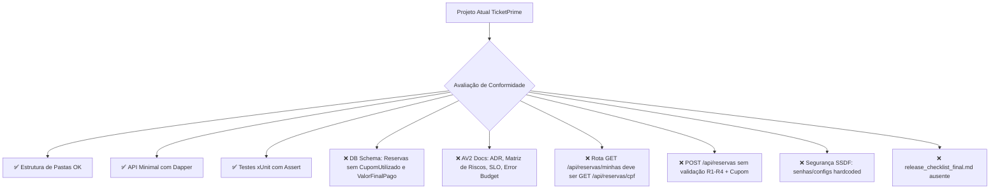
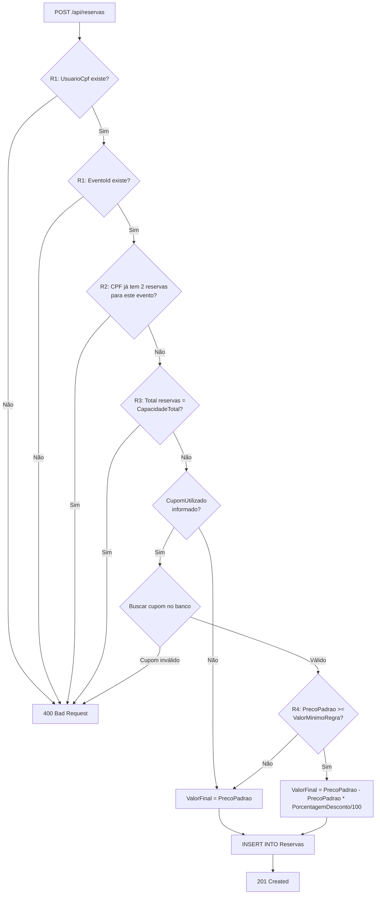
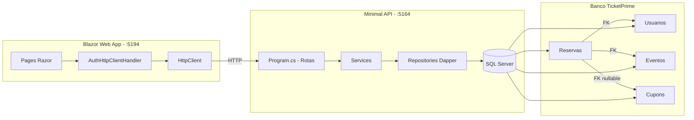

# 🎟️ Plano Completo — TicketPrime: Super Esqueleto Back + Front

## Sumário Executivo

Este documento contém o plano completo para alinhar o projeto TicketPrime existente com os requisitos oficiais da disciplina de Engenharia de Software, cobrindo **AV1** (fundação) e **AV2** (coração do sistema). O repositório atual já possui boa parte da estrutura, mas existem **discrepâncias críticas** que precisam ser corrigidas para atender à avaliação automatizada.

---

## 📊 Mapa da Situação Atual vs. Requerido



---

## 📋 Lista Completa de TODOs

### FASE 0 — Correções no Banco de Dados

| # | Tarefa | Arquivos | Descrição |
|---|--------|----------|-----------|
| 0.1 | **Adicionar colunas `CupomUtilizado` e `ValorFinalPago` à tabela `Reservas`** | [`db/script.sql`](db/script.sql) | A tabela `Reservas` precisa ter `CupomUtilido` VARCHAR(20) FK nullable para `Cupons.Codigo` e `ValorFinalPago DECIMAL(18,2)` conforme especificação |
| 0.2 | **Atualizar model `Reserva`** | [`src/Models/Reserva.cs`](src/Models/Reserva.cs) | Adicionar propriedades `CupomUtilizado` (string?) e `ValorFinalPago` (decimal) |
| 0.3 | **Atualizar `ReservaRepository`** | [`src/Infrastructure/Repository/ReservaRepository.cs`](src/Infrastructure/Repository/ReservaRepository.cs) | Incluir `CupomUtilizado` e `ValorFinalPago` no INSERT e SELECT |
| 0.4 | **Atualizar `IReservaRepository`** | [`src/Infrastructure/Interface/IReservaRepository.cs`](src/Infrastructure/Interface/IReservaRepository.cs) | Atualizar interface se necessário |
| 0.5 | **Atualizar `ReservaDetalhadaDTO`** | [`src/DTOs/ReservaDetalhadaDTO.cs`](src/DTOs/ReservaDetalhadaDTO.cs) | Incluir campos de cupom e valor pago |

### FASE 1 — Endpoints AV1 (Verificação e Ajustes)

| # | Tarefa | Arquivos | Descrição |
|---|--------|----------|-----------|
| 1.1 | ✅ Verificar `POST /api/eventos` | [`src/Program.cs`](src/Program.cs) | Já implementado com `RequireAuthorization(ADMIN)` |
| 1.2 | ✅ Verificar `GET /api/eventos` | [`src/Program.cs`](src/Program.cs) | Já implementado, público |
| 1.3 | ✅ Verificar `POST /api/cupons` | [`src/Program.cs`](src/Program.cs) | Já implementado com `RequireAuthorization(ADMIN)` |
| 1.4 | ✅ Verificar `POST /api/usuarios` | [`src/Program.cs`](src/Program.cs) | Já implementado, retorna 400 se CPF existir |
| 1.5 | **Corrigir retorno do cadastro de usuário** | [`src/Program.cs`](src/Program.cs:139) | Avaliar se o endpoint retorna status code correto (201 vs 400) |

### FASE 2 — Endpoints AV2 (Coração do Sistema)

| # | Tarefa | Arquivos | Descrição |
|---|--------|----------|-----------|
| 2.1 | **Criar `GET /api/reservas/{cpf}`** | [`src/Program.cs`](src/Program.cs) | Corrigir rota de `GET /api/reservas/minhas` para `GET /api/reservas/{cpf}` conforme especificação. Deve usar INNER JOIN para retornar Nome do Evento |
| 2.2 | **Refatorar `POST /api/reservas` para aceitar cupom** | [`src/Program.cs`](src/Program.cs) | Adicionar campo `CupomUtilizado` (opcional) no DTO de compra |
| 2.3 | **Implementar Regra R1 — Validação de Integridade** | [`src/Service/ReservaService.cs`](src/Service/ReservaService.cs) | Verificar se `UsuarioCpf` e `EventoId` existem nas respectivas tabelas antes de criar reserva |
| 2.4 | **Implementar Regra R2 — Limite por CPF** | [`src/Service/ReservaService.cs`](src/Service/ReservaService.cs) | Mesmo CPF não pode ter mais de 2 reservas (ou `LimiteIngressosPorUsuario`) para o mesmo `EventoId` |
| 2.5 | **Implementar Regra R3 — Controle de Estoque** | [`src/Service/ReservaService.cs`](src/Service/ReservaService.cs) | Contar reservas existentes para o `EventoId`; se == `CapacidadeTotal`, bloquear |
| 2.6 | **Implementar Regra R4 — Motor de Cupons** | [`src/Service/ReservaService.cs`](src/Service/ReservaService.cs) | Buscar cupom no banco; aplicar desconto sobre `PrecoPadrao` apenas se `PrecoPadrao >= ValorMinimoRegra` |
| 2.7 | **Adicionar método `ContarReservasPorEventoAsync`** | [`src/Infrastructure/Repository/ReservaRepository.cs`](src/Infrastructure/Repository/ReservaRepository.cs) | Novo método para contar total de reservas de um evento (controle de estoque R3) |
| 2.8 | **Adicionar método `ObterPorCodigoAsync` no `CupomService`** | [`src/Service/CupomService.cs`](src/Service/CupomService.cs) | Já existe, verificar integração |
| 2.9 | **Atualizar `ComprarIngressoDTO`** | [`src/DTOs/ComprarIngressoDTO.cs`](src/DTOs/ComprarIngressoDTO.cs) | Adicionar campo `CupomUtilizado` (string?, opcional) |
| 2.10 | **Adicionar repositório para contar reservas por evento** | [`src/Infrastructure/Repository/ReservaRepository.cs`](src/Infrastructure/Repository/ReservaRepository.cs) | `SELECT COUNT(*) FROM Reservas WHERE EventoId = @EventoId` |
| 2.11 | **Adicionar método na interface** | [`src/Infrastructure/Interface/IReservaRepository.cs`](src/Infrastructure/Interface/IReservaRepository.cs) | `Task<int> ContarReservasPorEventoAsync(int eventoId)` |

### FASE 3 — Documentação AV1 (Revisão)

| # | Tarefa | Arquivos | Descrição |
|---|--------|----------|-----------|
| 3.1 | ✅ Verificar Histórias de Usuário | [`docs/requisitos.md`](docs/requisitos.md) | Já existem 6 histórias no formato `Como... Quero... Para...` |
| 3.2 | ✅ Verificar Critérios BDD | [`docs/requisitos.md`](docs/requisitos.md) | Já existem com formato `Dado que... Quando... Então...` |
| 3.3 | ✅ Verificar README.md | [`README.md`](README.md) | Já contém comandos `dotnet run` |
| 3.4 | ✅ Verificar script SQL | [`db/script.sql`](db/script.sql) | Já existe, precisa adicionar colunas faltantes (Fase 0) |
| 3.5 | ✅ Verificar rotas mapeadas | [`src/Program.cs`](src/Program.cs) | Já usam `app.MapGet` e `app.MapPost` |
| 3.6 | ✅ Verificar Fail-Fast | [`src/Program.cs`](src/Program.cs) | Já retorna `Results.BadRequest` e `Results.NotFound` |
| 3.7 | ✅ Verificar Dapper com @ | Todos os repositórios | Já usam parâmetros `@` |
| 3.8 | ✅ Verificar zero SQL Injection | Todos os repositórios | Sem concatenação ou interpolação em SQL |
| 3.9 | ✅ Verificar infra xUnit | [`tests/`](tests/) | Projeto xUnit já existe com `[Fact]` e `[Theory]` |
| 3.10 | ✅ Verificar Assert nos testes | [`tests/UnitTest1.cs`](tests/UnitTest1.cs) a [`tests/UnitTest4.cs`](tests/UnitTest4.cs) | Todos os testes possuem `Assert.` |

### FASE 4 — Documentação AV2 (Nova)

| # | Tarefa | Arquivos | Descrição |
|---|--------|----------|-----------|
| 4.1 | **Criar ADR (Architecture Decision Record)** | [`docs/adr.md`](docs/adr.md) | Documento com seções: `## Contexto`, `## Decisão`, `## Consequências` (com Prós e Contras) |
| 4.2 | **Criar Matriz de Riscos** | [`docs/operacao.md`](docs/operacao.md) | Tabela com colunas: `Risco`, `Probabilidade`, `Impacto`, `Ação`, `Gatilho` |
| 4.3 | **Criar Métricas Operacionais** | [`docs/operacao.md`](docs/operacao.md) | Incluir campos: `Fórmula:`, `Fonte de Dados:`, `Frequência:`, `Ação se Violado:` |
| 4.4 | **Definir SLO** | [`docs/operacao.md`](docs/operacao.md) | Escrever `SLO:` com porcentagem (%) e janela de tempo (dias/horas) |
| 4.5 | **Criar Error Budget Policy** | [`docs/operacao.md`](docs/operacao.md) | Documentar o que o time deve fazer quando o tempo de falha se esgotar |
| 4.6 | **Criar release_checklist_final.md** | [`release_checklist_final.md`](release_checklist_final.md) | Checklist com caixas de seleção marcadas como `[x]` |
| 4.7 | **Remover senhas/configs hardcoded (SSDF)** | [`src/Program.cs`](src/Program.cs), [`docker-compose.yml`](docker-compose.yml) | Mover connection string e JWT Key para `appsettings.json` ou variáveis de ambiente |

### FASE 5 — Frontend (Blazor) — Ajustes

| # | Tarefa | Arquivos | Descrição |
|---|--------|----------|-----------|
| 5.1 | **Atualizar página de compra de ingresso** | [`ui/TicketPrime.Web/Components/Pages/`](ui/TicketPrime.Web/Components/Pages/) | Adicionar campo opcional de cupom no formulário de compra |
| 5.2 | **Atualizar listagem de reservas** | [`ui/TicketPrime.Web/Components/Pages/`](ui/TicketPrime.Web/Components/Pages/) | Exibir cupom utilizado e valor final pago |
| 5.3 | **Verificar navegação e rotas** | [`ui/TicketPrime.Web/Components/`](ui/TicketPrime.Web/Components/) | Garantir que todas as páginas funcionam com a API atualizada |

### FASE 6 — Testes Unitários (Complementares)

| # | Tarefa | Arquivos | Descrição |
|---|--------|----------|-----------|
| 6.1 | **Testar validação R1 (integridade)** | [`tests/`](tests/) | Testar se reserva falha com CPF ou EventoId inválidos |
| 6.2 | **Testar validação R2 (limite CPF)** | [`tests/`](tests/) | Testar bloqueio de mais de 2 reservas mesmo CPF/mesmo evento |
| 6.3 | **Testar validação R3 (estoque)** | [`tests/`](tests/) | Testar bloqueio quando capacidade total é atingida |
| 6.4 | **Testar validação R4 (cupom)** | [`tests/`](tests/) | Testar aplicação de desconto com e sem valor mínimo |
| 6.5 | **Testar GET /api/reservas/{cpf}** | [`tests/`](tests/) | Testar retorno com INNER JOIN |

---

## 🔄 Diagrama de Fluxo — Compra de Ingresso (AV2)



---

## 📐 Arquitetura do Sistema



---

## 📁 Estrutura Final Esperada do Repositório

```
ticketprime_api/
├── 📄 README.md                    # Comandos de terminal (AV1 Item 3)
├── 📄 release_checklist_final.md   # DoD Checklist (AV2 Item 10) ✨NOVO
├── 📄 TicketPrime.sln
│
├── /docs/
│   ├── 📄 requisitos.md            # User Stories + BDD (AV1 Itens 1-2) ✅
│   ├── 📄 adr.md                   # ADR com Contexto/Decisão/Consequências (AV2 Itens 1-2) ✨NOVO
│   ├── 📄 operacao.md              # Matriz de Riscos + Métricas + SLO + Error Budget (AV2 Itens 3-8) ✨NOVO
│   └── ... (demais documentos existentes)
│
├── /db/
│   └── 📄 script.sql               # CREATE TABLEs (AV1 Item 4) 🔧ATUALIZAR
│
├── /src/
│   ├── 📄 Program.cs               # Minimal API rotas (AV1 Item 5, AV2) 🔧ATUALIZAR
│   ├── 📄 appsettings.json         # Config segura (SSDF AV2 Item 9) 🔧ATUALIZAR
│   ├── /Models/                    # 🔧ATUALIZAR Reserva.cs
│   ├── /DTOs/                      # 🔧ATUALIZAR ComprarIngressoDTO
│   ├── /Service/                   # 🔧ATUALIZAR ReservaService.cs
│   ├── /Infrastructure/
│   │   ├── /Interface/             # 🔧ATUALIZAR IReservaRepository
│   │   └── /Repository/            # 🔧ATUALIZAR ReservaRepository.cs
│   └── ...
│
├── /tests/                         # Testes xUnit (AV1 Itens 9-10) ✅ + ✨NOVOS
│
└── /ui/TicketPrime.Web/            # Frontend Blazor 🔧ATUALIZAR
```

---

## 🎯 Resumo dos Itens de Avaliação

### AV1 (10 itens — maior parte já OK)

| Item | Status | Ação |
|------|--------|------|
| 1. Histórias de Usuário | ✅ OK | Nada a fazer |
| 2. Critérios BDD | ✅ OK | Nada a fazer |
| 3. README Executável | ✅ OK | Nada a fazer |
| 4. Script do Banco | ⚠️ Parcial | Adicionar colunas faltantes em Reservas |
| 5. Contrato da API | ✅ OK | Rotas mapeadas corretamente |
| 6. Fail-Fast Validação | ✅ OK | BadRequest/NotFound implementados |
| 7. Segurança Dapper | ✅ OK | Parâmetros @ em uso |
| 8. Zero SQL Injection | ✅ OK | Sem concatenação |
| 9. Infra xUnit | ✅ OK | Projeto configurado |
| 10. Testes com Assert | ✅ OK | Todos com Assert |

### AV2 (10 itens — maioria precisa ser criada)

| Item | Status | Ação |
|------|--------|------|
| 1. ADR | ❌ Ausente | Criar [`docs/adr.md`](docs/adr.md) |
| 2. Trade-offs no ADR | ❌ Ausente | Incluir Prós e Contras |
| 3. Matriz de Riscos | ❌ Ausente | Criar [`docs/operacao.md`](docs/operacao.md) |
| 4. Gatilhos de Risco | ❌ Ausente | Incluir coluna Gatilho |
| 5. Métricas Operacionais | ❌ Ausente | Adicionar Fórmula, Fonte, Frequência |
| 6. Ação da Métrica | ❌ Ausente | Adicionar Ação se Violado |
| 7. SLO | ❌ Ausente | Definir SLO com % e janela de tempo |
| 8. Error Budget Policy | ❌ Ausente | Documentar política |
| 9. SSDF Segurança | ⚠️ Parcial | Mover configs para appsettings/ambiente |
| 10. DoD Checklist | ❌ Ausente | Criar [`release_checklist_final.md`](release_checklist_final.md) |

---

## 🧩 Decisões Arquiteturais (para o ADR)

### Decisão 1: Dapper com SQL Puro (já implementado)
- **Contexto**: Necessidade de segurança contra SQL Injection e controle total sobre queries
- **Decisão**: Usar Dapper com parâmetros `@` em vez de Entity Framework
- **Consequências**: Prós: performance, segurança, controle; Contras: mais código manual

### Decisão 2: Minimal API (já implementado)
- **Contexto**: Simplicidade e clareza nas rotas
- **Decisão**: Usar Minimal API em vez de Controllers tradicionais
- **Consequências**: Prós: menos boilerplate; Contras: pode ficar bagunçado sem organização

### Decisão 3: Blazor Server para Frontend (já implementado)
- **Contexto**: Equipe já conhece C#, necessidade de integração direta com backend
- **Decisão**: Usar Blazor Server com renderização interativa
- **Consequências**: Prós: C# full-stack, rico em componentes; Contras: dependência de conexão SignalR

---

## ⚠️ Riscos Técnicos Identificados

| Risco | Probabilidade | Impacto | Ação de Mitigação | Gatilho |
|-------|--------------|---------|-------------------|---------|
| Superlotação de evento | Média | Alto | Implementar R3 com COUNT atômico antes do INSERT | Venda de ingressos próxima à capacidade total |
| Fraude com cupom | Baixa | Alto | Implementar R4 com validação de valor mínimo | Cupom com código promocional público |
| SQL Injection | Muito Baixa | Crítico | Uso obrigatório de parâmetros @ em TODAS as queries | Nova query adicionada sem parâmetro |
| CPF duplicado | Média | Médio | Verificação prévia no POST /api/usuarios | Tentativa de cadastro com CPF existente |
| Token JWT exposto | Baixa | Alto | Uso de HTTPS e HttpOnly cookies | Configuração de ambiente de produção |
| Reservas concorrentes | Alta | Alto | Transação isolada no INSERT + verificação de estoque | Pico de vendas (black Friday) |
| Vazamento de connection string | Média | Crítico | Remover hardcoded, usar User Secrets/ambiente | Commit de config com senha no repositório |

---

## 📊 Métricas Operacionais

| Métrica | Fórmula | Fonte de Dados | Frequência | Ação se Violado |
|---------|---------|---------------|------------|-----------------|
| Taxa de Sucesso de Reservas | `(Reservas com sucesso / Total tentativas) * 100` | Logs da API | Diária | Investigar causa raiz se < 95% |
| Tempo de Response (p95) | Percentil 95 do tempo de resposta do POST /api/reservas | APM / Logs | A cada requisição | Otimizar query ou adicionar índice se > 2s |
| Estoque Restante | `CapacidadeTotal - COUNT(Reservas)` | Banco de dados | A cada reserva | Alertar equipe se < 10% da capacidade |
| Uso de Cupons | `COUNT(Reservas com cupom) / Total reservas` | Banco de dados | Semanal | Revisar política de descontos se > 30% |

---

## 🎯 SLO (Service Level Objective)

**SLO: 99.5%** de disponibilidade mensal (janela de 30 dias corridos).

Isso significa que o sistema pode ficar indisponível por no máximo **~3 horas e 36 minutos** por mês (0.5% de 43.200 minutos).

## ⚡ Error Budget Policy

**Error Budget Policy**: 0.5% do tempo mensal (≈ 3h36min).

- Se o **Error Budget não foi exaurido** (falhas < 0.5%): O time pode continuar entregando novas funcionalidades normalmente.
- Se o **Error Budget foi exaurido** (falhas >= 0.5%): O time DEVE:
  1. Parar imediatamente todo desenvolvimento de novas funcionalidades
  2. Dedicar 100% do tempo para investigar e corrigir a causa raiz da instabilidade
  3. Implementar melhorias de resiliência (retry policies, circuit breakers, caching)
  4. Só retomar desenvolvimento após 7 dias consecutivos sem violação do SLO
  5. Documentar o incidente em um Postmortem

---

## 📝 Próximos Passos Imediatos

1. **Revisar e aprovar este plano** com o orientador/equipe
2. **Iniciar pela Fase 0** (correções no banco de dados) — é a base de tudo
3. **Seguir para Fase 2** (endpoints AV2) — coração do sistema
4. **Fase 4** (documentação AV2) pode ser feita em paralelo
5. **Testes (Fase 6)** devem ser escritos junto com o código
6. **Finalizar com DoD Checklist** (Fase 4.6)

---

*Plano gerado em 2026-05-09 como parte do planejamento do TicketPrime*
